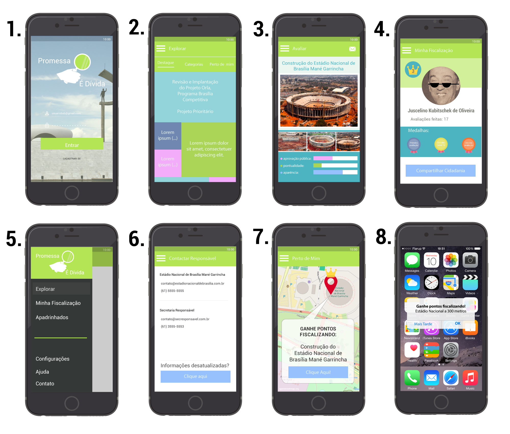

# Projeto Hackathon Cotidiano

09/07 - 15/07/2016
React Native App

===========
## Objetivos:

Criar uma aplicação multi-plataforma de código aberto que possibilite a interação do cidadão com as propostas, metas e promessas feitas pelo governo em exercício do poder. Nesta aplicação poderão ser feitas avaliações sobre construções, reformas, revitalizações ou serviços
executados pelo governo aproximando também o cidadão da fiscalização dos gastos públicos.

===========
## Modelagem:

### Diagrama Inicial 09/07:

- Plataforma para **avaliar promessas / metas do governo pelo cidadão**
- Inicialmente focado em **Infra-estrutura** (como obras, reformas) em andamento
- Classificação por meio de expectativa / impressão, um "perfil" da promessa que conterá fotos e avaliações de seu processo

### Protótipo / Mockup 12/07:

1. **Tela Login**
2. **Tela Inicial Explorar:** Apresenta metas estabelecidas pelo governo. Abas para filtragem:
  * 'Destaque', 'Categoria' e 'Perto de Mim'
3. **Tela Avaliar:** Apresenta perfil da meta estabelecida pelo governo, com fotos e avaliações do cidadão - possibilita contactar responsável
4. **Tela Minha Fiscalização:** Apresenta perfil do usuário cidadão, com medalhas e conquistas dentro da pontuação do aplicativo
5. **Aba Lateral**
6. **Tela Contactar Responsável:** Apresenta dados dos principais responsáveis pela meta estabelecida
7. **Tela Perto de Mim:** Apresenta pontos de metas mapeados mais geograficamente próximos do usuário
8. **Alerta de proximidade:** Caso o usuário transite perto de um ponto mapeado ele será alertado. O usuário que informar a situação da meta receberá pontos por isso.

===========

## Bibliografia:

- [GitHook IBM](https://hub.jazz.net/gitHook/)
- [Observatório Social de Brasília](http://brasilia.osbrasil.org.br/)
- [Compromissos dos órgãos do GDF para 2016](http://brasilia.osbrasil.org.br/blog/2016/04/02/veja-os-compromissos-dos-orgaos-do-gdf-para-2016/)
- [React Native](https://facebook.github.io/react-native/docs)
- [react-native-image-picker](https://github.com/marcshilling/react-native-image-picker)
- [react-native-spinkit](https://github.com/maxs15/react-native-spinkit)
- [Drawing Charts in React Native without any library](https://medium.com/@wwayne_me/let-s-drawing-charts-in-react-native-without-any-library-4c20ba38d8ab#.1g1p58edy)

===========
